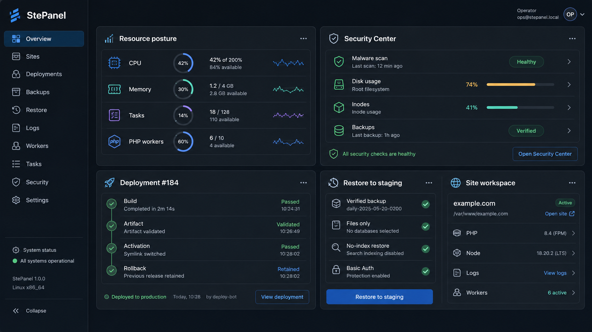
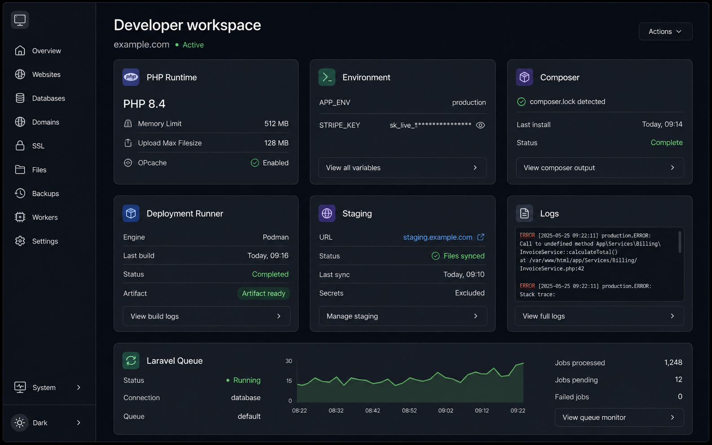

# StePanel

> Documentation version: `main / unreleased`. Latest stable release:
> [`v0.6.0`](https://github.com/itchyitchy123/StePanel/tree/v0.6.0). Features
> added after that tag are documented only for the current `main` branch.

  

> A safety-first Linux web and application hosting control plane with cPanel migration tooling.

StePanel is an open-source server management panel written in Go. It installs Caddy by default, with Apache and OpenLiteSpeed available explicitly, plus PHP and a selectable MySQL, MariaDB, or PostgreSQL version. It provides a focused operations dashboard and imports cPanel `cpmove` backups through an asynchronous, validated workflow.

It is designed for people who want a small, understandable hosting control plane instead of a large opaque platform.



The operator workspace is the strongest overview of StePanel's current value:
resource posture, security checks, deployment state, restore-to-staging, and
managed site operations in one view. It uses deterministic representative data;
it is a product illustration rather than a capture from a live host.



The developer workspace shows the application workflow around PHP runtime,
encrypted environment metadata, builds, staging, logs, and workers.

## Why StePanel?

- **Migration-focused:** move cPanel accounts into a controlled Linux hosting environment.
- **Safety-first:** validate archives, reject unsafe entries, stage uploads privately, and expose restore status as a job.
- **Small footprint:** a Go control plane with a limited dependency surface.
- **Operator-friendly:** clear health endpoints, tamper-evident audit events, systemd deployment, and readable documentation.
- **Flexible database layer:** choose MySQL, MariaDB, or PostgreSQL and request an exact repository/AppStream version during installation.
- **Database administration:** optionally install phpMyAdmin for MySQL/MariaDB or phpPgAdmin for PostgreSQL; the dashboard reports service health and links to the matching administrator.

## Current capabilities

| Area | Included today |
| --- | --- |
| Installation | Caddy by default, or Apache/OpenLiteSpeed, PHP, MySQL/MariaDB/PostgreSQL, optional phpMyAdmin/phpPgAdmin, Exim/Dovecot/SpamAssassin/vsftpd, systemd, Debian/Ubuntu and RHEL-family systems |
| Migration | cPanel `.tar.gz` inspection, safe staging, website, SQL, staged mailbox restore, and fail-closed `.htaccess` conversion for Caddy |
| Operations | Dashboard, health endpoint, metrics endpoint, audit log, asynchronous restore jobs |
| Shared-hosting beta | Administrator-provisioned customer accounts with independent TOTP MFA, enforced assigned-site limits, and customer-scoped site/backup/job access |
| Security | bcrypt credentials, signed sessions, CSRF protection, archive traversal checks, restricted service user |
| Delivery | Dockerfile, ARM64/AMD64 release workflow, checksums, CI, vulnerability scanning |

For cloud inventory/actions, DNS adapters, SSH inventory, WAF capability
constraints, off-site backups, and operational configuration, see the
[integration guide](docs/INTEGRATIONS.md), [installation guide](docs/INSTALLATION.md),
and [operations runbook](docs/OPERATIONS.md).

> **Status:** StePanel includes a constrained single-host shared-hosting beta. It is not yet a complete multi-tenant hosting platform: plans enforce aggregate account and per-site application CPU, memory, process, PHP-worker, disk, and inode ceilings when the host quota prerequisites are available. Bandwidth, mail, file, external-provider teardown, and Redis runtime enforcement remain provider/operator boundaries; database lifecycle, local site termination, and plan caps are available on supported local engines. Administrator resource profiles, security posture, verified restores, and restore-to-staging are available with explicit beta/operator boundaries. Run it behind authenticated HTTPS and test restores against a disposable server before using production data.

## Architecture at a glance

```text
Browser / API client
        │ authenticated HTTPS
        ▼
Go control plane ── durable jobs, audit chain, desired state
        │ narrow typed helper calls
        ▼
Root-owned platform helpers ── Caddy/Apache, PHP-FPM, databases, systemd
        │ isolated site identities and cgroup profiles
        ▼
Web applications, databases, verified backups, recoverable releases
```

See the [complete product preview](docs/SCREENSHOTS.md) for the dashboard and
all workspace illustrations. A live lab screenshot is intentionally not
included until it can be captured from a disposable tagged installation with
synthetic data.

Operational key backup and rotation procedures are documented in
[`docs/SECRETS.md`](docs/SECRETS.md).

### Local development

Requirements: Go 1.26+.

```sh
git clone https://github.com/itchyitchy123/StePanel.git
cd StePanel
make check
go run .
```

Open <http://localhost:8080>. Local development uses `data/imports` and `data/www`, so root access is not required.

### Container

The container packages the control plane only. It does not run Apache, PHP, or a database server inside the container. Database administrator packages are host integrations and are not installed in the container image.

```sh
docker build -t stepanel:local .
docker run --rm -p 8080:8080 \
  -e STEPANEL_ENV=development \
  -e STEPANEL_ADMIN_PASSWORD='use-a-password-manager' \
  -e STEPANEL_SESSION_SECRET='use-at-least-32-random-characters' \
  -e STEPANEL_AUDIT_KEY='use-a-different-32-character-secret' \
  stepanel:local
```

### Server installation from a release

Use a tagged release artifact for production installation. The archive
contains the binary, installer, helpers, service files, and web assets needed
by `install.sh`:

```sh
release=v0.6.0
arch=amd64 # use arm64 on aarch64 hosts
curl -fsSLO "https://github.com/itchyitchy123/StePanel/releases/download/${release}/stepanel_${release#v}_linux_${arch}.tar.gz"
curl -fsSLO "https://github.com/itchyitchy123/StePanel/releases/download/${release}/SHA256SUMS"
grep "stepanel_${release#v}_linux_${arch}.tar.gz" SHA256SUMS | sha256sum -c -
tar -xzf "stepanel_${release#v}_linux_${arch}.tar.gz"
sudo STEPANEL_ADMIN_PASSWORD='use-a-password-manager' \
  STEPANEL_PANEL_HOSTNAME=panel.example.com \
  STEPANEL_DB_ENGINE=mariadb \
  STEPANEL_DB_VERSION=default ./install.sh
```

The installer records the selected database engine/version, creates a restricted `stepanel` service account, writes the requested panel hostname into the selected webserver, and binds the control plane to `127.0.0.1:8090`. Caddy provisions HTTPS automatically; Apache installations must complete TLS termination before signing in.

Nightly/manual installation smoke CI exercises real disposable systemd hosts
for AlmaLinux, Rocky Linux, Ubuntu, and Debian, including package installation,
service restart, synthetic site creation, and selected-webserver validation.

Verify release provenance and the GitHub attestation before installing on a
production host. The checksum authenticates download integrity; the release
page's SBOM and build-provenance attestation provide the corresponding supply
chain evidence. Building from source is a developer/contributor workflow:
see [Local development](#local-development) and keep it separate from the
normal operator installation path.

After installation, inspect the running binary and build provenance with:

```sh
/opt/stepanel/stepanel version
```

Run `stepanel dr-check` on a host to emit a secret-safe control-plane disaster
recovery manifest. It inventories state files, keys, Git trust material,
external rclone dependencies, site data, and regeneration-only helpers without
copying secret values. Use `stepanel backup-control-plane DEST` to create a
verified SQLite backup, and `stepanel restore-control-plane SOURCE --dry-run`
to validate a candidate before the guarded maintenance-window restore:
`stepanel restore-control-plane SOURCE --replace`.

## Quick workflows

- Migrate a cPanel account with the [cpmove guide](docs/CPMOVE_IMPORTS.md).
- Restore a WordPress `.wpress` archive with the [WordPress guide](docs/WPRESS_IMPORTS.md).
- Deploy and roll back a site through [Git releases](docs/GIT_DEPLOYMENTS.md).
- Run the [disposable lab](deploy/lab/README.md) before touching production data.

## Documentation

Start with the [installation guide](docs/INSTALLATION.md), [feature catalog](docs/FEATURES.md),
[architecture and safety model](docs/ARCHITECTURE.md), [operations runbook](docs/OPERATIONS.md),
[developer workflows](docs/DEVELOPER_WORKFLOWS.md), or [API contract](docs/openapi.yaml).

The deeper references cover [backups and recovery](docs/CASE_STUDY.md),
[security](docs/THREAT_MODEL.md), [integrations](docs/INTEGRATIONS.md),
[release engineering](docs/RELEASING.md), the [incident lab](docs/INCIDENT_LAB.md),
[measured recovery evidence](docs/lab-results/2026-09-06-recovery-drills.md),
[observability](observability/README.md), and [contributing](CONTRIBUTING.md).
See the [ADR index](docs/adr/README.md), [changelog](CHANGELOG.md), and
[release artifacts](https://github.com/itchyitchy123/StePanel/releases) for
project history and version-specific material.

## API reference

The landing page keeps the operator workflow concise. See the versioned
[OpenAPI contract](docs/openapi.yaml) for the complete endpoint, request,
response, and authorization reference.

## Configuration

Configuration is intentionally documented in the [installation guide](docs/INSTALLATION.md)
and [secrets/DR guide](docs/SECRETS.md), rather than duplicated on the landing
page. Those references include the complete environment-variable table,
production validation rules, key backup and rotation procedures.

Invalid numeric limits and unsafe production paths are rejected at startup
instead of silently falling back to defaults. Production state paths must be
absolute so service behavior does not depend on its working directory.

Set `STEPANEL_INSTALL_MAIL=1` during installation to install Exim, Dovecot,
and SpamAssassin.

Set `STEPANEL_INSTALL_FTP=1` to install and enable vsftpd. The panel reports
vsftpd in the service inventory. Local users are chrooted to their site root
and passive ports default to `40100-40200`; configure FTPS and create
least-privilege site users before allowing external access. Plain FTP should
only be used on a trusted management network.

Set `STEPANEL_INSTALL_NODE=1 STEPANEL_NODE_VERSIONS=20.18.0,22.14.0` to install
Node versions through NVM. The panel can select an installed version per site
and generate a validated reverse proxy for a local app backend in the selected
webserver.
Managed apps are supervised by per-site systemd units and can be started,
stopped, or restarted through the authenticated API.

Set `STEPANEL_INSTALL_SECURITY=1` to install ClamAV, inotify-based PHP
monitoring, and recoverable quarantine handling. This is a defense-in-depth
layer, not a guarantee against all malware; keep applications patched and use
least-privilege service accounts.
Mailbox contents are preserved in the private mail root and reported by the
restore job; activation still requires destination domain, mailbox, DNS, TLS,
and credential mapping.

## Roadmap

The next product milestones are first-run setup, verified backups, safer
upgrades, resource quotas, and multi-user roles. See the
[roadmap](docs/ROADMAP.md) for the full plan.

## License

StePanel is released under the [MIT License](LICENSE).
