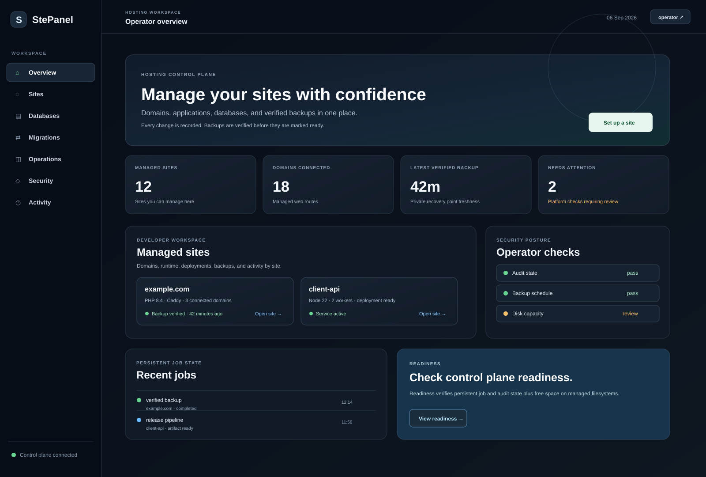

# StePanel

  

> A modern, safety-first control plane for LAMP hosting and cPanel migrations.

StePanel is an open-source server management panel written in Go. It installs Apache, PHP, and a selectable MySQL or MariaDB version, provides a focused operations dashboard, and imports cPanel `cpmove` backups through an asynchronous, validated workflow.

It is designed for people who want a small, understandable hosting control plane instead of a large opaque platform.

## Why StePanel?

- **Migration-focused:** move cPanel accounts into a controlled LAMP environment.
- **Safety-first:** validate archives, reject unsafe entries, stage uploads privately, and expose restore status as a job.
- **Small footprint:** a Go control plane with a limited dependency surface.
- **Operator-friendly:** clear health endpoints, audit events, systemd deployment, and readable documentation.
- **Flexible database layer:** choose MySQL or MariaDB and request an exact repository version during installation.

## Current capabilities

| Area | Included today |
| --- | --- |
| Installation | Apache, PHP, MySQL/MariaDB, optional Exim/Dovecot/SpamAssassin/vsftpd, systemd, Debian/Ubuntu and RHEL-family systems |
| Migration | cPanel `.tar.gz` inspection, safe staging, website, SQL, and staged mailbox restore |
| Operations | Dashboard, health endpoint, metrics endpoint, audit log, asynchronous restore jobs |
| Security | bcrypt credentials, signed sessions, CSRF protection, archive traversal checks, restricted service user |
| Delivery | Dockerfile, ARM64/AMD64 release workflow, checksums, CI, vulnerability scanning |

ModSecurity with optional OWASP CRS is available through the installer in
safe `DetectionOnly` mode. See [integrations](docs/INTEGRATIONS.md).

> **Status:** StePanel is in early development. It is not yet a complete multi-tenant hosting platform. Run it behind authenticated HTTPS and test restores against a disposable server before using production data.

## See it quickly



See the [product preview](docs/SCREENSHOTS.md) for the current dashboard direction.

### Local development

Requirements: Go 1.26+.

```sh
git clone https://github.com/itchyitchy123/StePanel.git
cd StePanel
make check
go run .
```

Open <http://localhost:8080>. Local development uses `data/imports` and `data/www`, so root access is not required.

### Container

The container packages the control plane only. It does not run Apache or MySQL/MariaDB inside the container.

```sh
docker build -t stepanel:local .
docker run --rm -p 8080:8080 \
  -e STEPANEL_ADMIN_PASSWORD='change-me' \
  -e STEPANEL_SESSION_SECRET='use-at-least-32-random-characters' \
  stepanel:local
```

### Server installation

Build a release binary and run the installer as root:

```sh
go build -trimpath -ldflags='-s -w' -o stepanel .
sudo STEPANEL_ADMIN_PASSWORD='use-a-password-manager' \
  STEPANEL_PANEL_HOSTNAME=panel.example.com \
  STEPANEL_DB_ENGINE=mariadb \
  STEPANEL_DB_VERSION=default ./install.sh
```

The installer records the selected database engine/version, creates a restricted `stepanel` service account, writes the requested Apache hostname, and binds the control plane to `127.0.0.1:8090`. Complete HTTPS termination before signing in.

## cpmove migration

1. Snapshot the destination server.
2. Open the migration center and upload a cPanel `.tar.gz` archive.
3. Choose the destination account and whether SQL should be restored.
4. Type `IMPORT` to authorize the operation.
5. Poll the returned job status until it completes or fails.
6. Review the audit log and verify the site before switching traffic.

Website files are restored to `/var/www/sites/<account>/public`. SQL dumps are restored to new account-prefixed database names; existing databases are refused. Existing destination files can be overwritten only with explicit confirmation; always snapshot first.

## WordPress `.wpress` migration

The panel also restores All-in-One WP Migration archives. Install
`wpress-extract`, WP-CLI, and a MariaDB/MySQL client on the host, then use the
WordPress migration card in the dashboard. The authenticated preflight endpoint
is `/api/wpress/preflight`.

The restore provisions a site-prefixed database and user, imports the archive,
converts the archive table prefix with WP-CLI serialized-data support, and can
replace the old site URL. Existing site files require the explicit overwrite
checkbox and should be backed up first.

## Documentation

- [Installation guide](docs/INSTALLATION.md)
- [Node application deployment](docs/NODE_APPS.md)
- [Node application lifecycle](docs/APP_LIFECYCLE.md)
- [cpmove migration guide](docs/CPMOVE_IMPORTS.md)
- [WordPress WPress migration guide](docs/WPRESS_IMPORTS.md)
- [Architecture and safety model](docs/ARCHITECTURE.md)
- [Feature catalog](docs/FEATURES.md)
- [Threat model](docs/THREAT_MODEL.md)
- [Malware guard](docs/MALWARE_GUARD.md)
- [HTTPS certificates](docs/CERTIFICATES.md)
- [API contract](docs/openapi.yaml)
- [Release procedure](docs/RELEASING.md)
- [Operations runbook](docs/OPERATIONS.md)
- [Product roadmap](docs/ROADMAP.md)
- [Launch kit and repository metadata](docs/LAUNCH_KIT.md)
- [Portfolio direction](docs/PORTFOLIO.md)
- [Service objectives](docs/SLO.md)
- [Incident lab and recovery scenarios](docs/INCIDENT_LAB.md)
- [Demo walkthrough](docs/DEMO.md)
- [Observability bundle](observability/README.md)
- [Deployment examples](deploy/)
- [Disposable end-to-end lab](deploy/lab/README.md)
- [FPM Lens and Fail2ban integrations](docs/INTEGRATIONS.md)
- [GitHub security hardening](docs/GITHUB_HARDENING.md)
- [Contributing](CONTRIBUTING.md)
- [Support](SUPPORT.md)
- [Security policy](SECURITY.md)
- [Changelog](CHANGELOG.md)
- [Release artifacts](https://github.com/itchyitchy123/StePanel/releases)

## API surface

| Method | Endpoint | Purpose |
| --- | --- | --- |
| `GET` | `/api/health` | Version and service health |
| `GET` | `/api/services` | Authenticated live Apache, PHP, database, Fail2Ban, and ModSecurity inventory |
| `GET` | `/api/ftp` | Authenticated vsftpd status, chroot posture, and passive-port configuration |
| `GET` | `/api/security/audit` | Authenticated configuration and security posture checks |
| `GET` | `/api/node/versions` | List installed NVM Node versions |
| `POST` | `/api/node/select` | Select an installed Node version for a managed site |
| `POST` | `/api/proxy/deploy` | Generate and reload a validated Apache reverse proxy |
| `GET` | `/api/proxy` | List managed reverse proxies |
| `POST` | `/api/proxy/test` | Test a local/private application backend |
| `DELETE` | `/api/proxy/<config>` | Remove a managed reverse proxy and reload Apache |
| `POST` | `/api/certificates/issue` | Queue a validated Let’s Encrypt certificate request |
| `POST` | `/api/apps/<site>/rollback` | Roll back a managed Node app to its previous manifest |
| `POST` | `/api/security/scan` | Scan a managed site for suspicious PHP and optionally quarantine findings |
| `POST` | `/api/cpmove/inspect` | Validate and inspect a backup |
| `POST` | `/api/cpmove/import` | Start an authorized restore job |
| `GET` | `/api/jobs/<id>` | Poll restore status |
| `GET` | `/metrics` | Prometheus-compatible process metric |

## Configuration

| Variable | Purpose |
| --- | --- |
| `STEPANEL_LISTEN` | HTTP listen address |
| `STEPANEL_ENV` | Set to `production` to enforce production authentication requirements |
| `STEPANEL_ADMIN_USERNAME` | Administrator username |
| `STEPANEL_ADMIN_PASSWORD` | Administrator password |
| `STEPANEL_SESSION_SECRET` | Persistent session-signing secret, minimum 32 characters |
| `STEPANEL_DB_ENGINE` | `mysql` or `mariadb` during installation |
| `STEPANEL_DB_VERSION` | `default` or an exact repository version |
| `STEPANEL_IMPORT_ROOT` | Private backup staging directory |
| `STEPANEL_WEB_ROOT` | Site destination root |
| `STEPANEL_AUDIT_LOG` | JSONL audit log path |
| `STEPANEL_WPRESS_EXTRACT` | WPress extractor executable; default `wpress-extract` |
| `STEPANEL_WPCLI` | WP-CLI executable; default `wp` |
| `STEPANEL_DB_HOST` | MySQL/MariaDB host used for SQL imports |
| `STEPANEL_DB_USER` | Database user used for SQL imports |
| `STEPANEL_DB_PASSWORD` | Database password supplied through the process environment |
| `STEPANEL_MAIL_ROOT` | Private root for staged cPanel mailbox data |
| `STEPANEL_METRICS_PUBLIC` | Set to `1` only when Prometheus metrics must be unauthenticated |
| `STEPANEL_STAGE_RETENTION_HOURS` | Retention for completed restore staging directories; default `168` |
| `STEPANEL_MIN_FREE_BYTES` | Minimum free space required before accepting a restore; default `1073741824` |

Set `STEPANEL_INSTALL_MAIL=1` during installation to install Exim, Dovecot,
and SpamAssassin.

Set `STEPANEL_INSTALL_FTP=1` to install and enable vsftpd. The panel reports
vsftpd in the service inventory. Local users are chrooted to their site root
and passive ports default to `40100-40200`; configure FTPS and create
least-privilege site users before allowing external access. Plain FTP should
only be used on a trusted management network.

Set `STEPANEL_INSTALL_NODE=1 STEPANEL_NODE_VERSIONS=20.18.0,22.14.0` to install
Node versions through NVM. The panel can select an installed version per site
and generate a validated Apache reverse proxy for a local app backend.
Managed apps are supervised by per-site systemd units and can be started,
stopped, or restarted through the authenticated API.

Set `STEPANEL_INSTALL_SECURITY=1` to install ClamAV, inotify-based PHP
monitoring, and recoverable quarantine handling. This is a defense-in-depth
layer, not a guarantee against all malware; keep applications patched and use
least-privilege service accounts.
Mailbox contents are preserved in the private mail root and reported by the
restore job; activation still requires destination domain, mailbox, DNS, TLS,
and credential mapping.

## Roadmap

The next product milestones are first-run setup, site/domain lifecycle, PHP-FPM and database management, verified backups, and multi-user roles. See the [roadmap](docs/ROADMAP.md) for the full plan.

## License

StePanel is released under the [MIT License](LICENSE).
