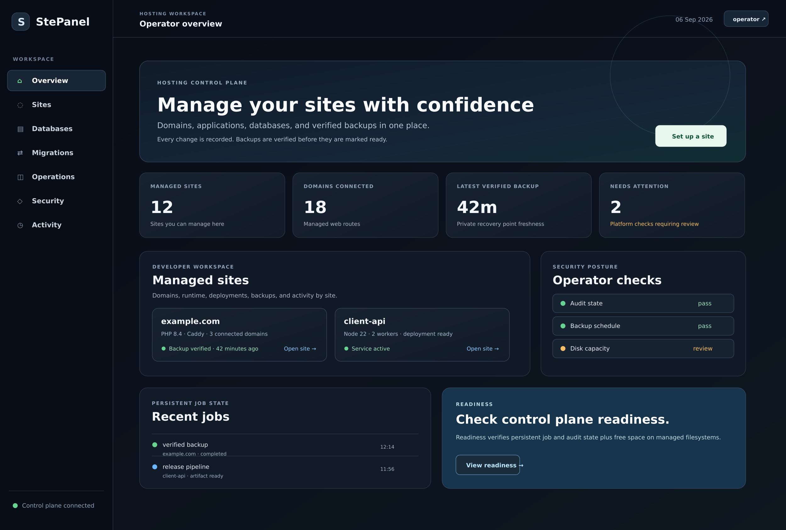

# Product preview

The assets in this document are synchronized with the current development
administrator dashboard after `0.6.0`, including the managed-sites workspace.
They are deterministic product illustrations, not captures from a live host;
values are representative and the real dashboard renders service, site,
database, capability, job state, and user role from the configured server.

## Dashboard

The preview is rendered at 2× resolution for crisp display on GitHub and
retina screens. The editable [SVG source](assets/dashboard-preview.svg) remains
available for presentations and product materials.

## What the preview covers

<table>
<tr>
<td width="50%"><strong>Live operations</strong> Service inventory, health counts, load, uptime, and attention states come from the host rather than placeholder activity.</td>
<td width="50%"><strong>Safe migrations</strong> The migration center makes cpmove and WordPress restore workflows visible, reviewable, and asynchronous.</td>
</tr>
<tr>
<td><strong>Database operations</strong> The current dashboard identifies the engine and adds native database inventory, least-privilege provisioning, credential rotation, diagnostics, and safety-dump-protected deletion.</td>
<td><strong>Persistent jobs</strong> Restore, backup, certificate, and application work is represented by durable job state with status links.</td>
</tr>
<tr>
<td><strong>Security posture</strong> Operator checks, readiness, request correlation, and capability-aware controls are surfaced before changes are made.</td>
<td><strong>Developer workspace</strong> Managed sites group domains, application state, proxies, database counts, and verified recent activity.</td>
</tr>
</table>

This illustration mirrors the current development dashboard structure using
representative values, including Caddy as the selected webserver, automatic
HTTPS, the managed-sites workspace, database operations panel, and the
Apache-to-Caddy `.htaccess` migration entry point.
At runtime, all service counts, health states, load, security checks, and jobs
come from the current server; the application does not ship simulated activity.

## Customer workspace

The shared-hosting beta has a separate, role-aware customer workspace. It uses
the same professional navigation, responsive task cards, and accessible visual
system as the administrator dashboard, but it shows the customer's plan,
assigned-site count, assigned site cards, and matching backup/job activity.
Infrastructure, security, database, migration, cloud, SSH, and account
administration controls are intentionally absent. The server enforces the same
scope at the API boundary; this is not only a visual simplification.

The preview above is an administrator illustration, not a customer screenshot.
For release review, capture both roles from the tagged build with synthetic
data and verify the mobile layout as well as the role boundary. See
[`SHARED_HOSTING.md`](SHARED_HOSTING.md) for the supported customer scope.

For release reviews, capture a screenshot from the tagged build as a supplement
to this deterministic preview. Real screenshots are useful for verifying theme,
responsive layout, and capability-specific controls on a target host.
